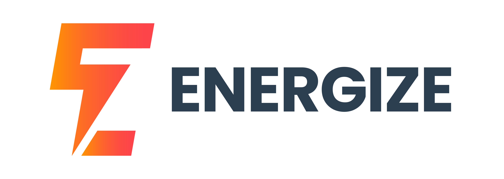

<p align="center">

</p>

<p align="center">Meet Energize: Your laptop&#39;s essential battery diagnostic tool.Optimize performance, prolong battery life effortlessly.</p>

<br>


<p align="center">
  <a href="https://github.com/Malick-Tammal/ENERGIZE/blob/main/CHANGELOG.md" target="_blank">Changelog<a>
  -
  <a href="https://github.com/Malick-Tammal/ENERGIZE/issues/new">Request feature<a>
  -
  <a href="https://github.com/Malick-Tammal/ENERGIZE/issues/new">Report bug<a>
</p>

<br>

<p align="center">
<a href="https://github.com/Malick-Tammal/ENERGIZE/graphs/contributors" target="_blank">
  
</a>
<a href="https://github.com/Malick-Tammal/ENERGIZE/stargazers" target="_blank">
  
</a>
<a href="https://github.com/Malick-Tammal/ENERGIZE/issues" target="_blank">
  
</a>
<a href="https://github.com/Malick-Tammal/ENERGIZE/blob/main/LICENSE" target="_blank">
  
</a>
</p>

<p align="center">
  <a href="https://github.com/Malick-Tammal/ENERGIZE/releases" target="_blank">
    
  </a>
  <a href="https://github.com/Malick-Tammal" target="_blank">
    
  </a>
  <a href="https://github.com/Malick-Tammal/ENERGIZE/blob/main/README.md" target="_blank">
    
  </a>
  <a href="https://github.com/Malick-Tammal/battery_util/graphs/commit-activity" target="_blank">
    
  </a>
</p>

---

## Usage

Download the app [Latest release!](https://github.com/Malick-Tammal/ENERGIZE/releases/download/v1.0.0/energize-Setup-1.0.0.exe)

For devs clone the repository

```sh
git clone https://github.com/Malick-Tammal/ENERGIZE.git
```

## Install

```sh
npm install
```

## Usage

```sh
npm start
```

## 🌟 Features

- Get real time battery states
- Check battery health (Accurate reads)
- Get battery info (batteryId , batteryModel ....)

## 🚀 Features will added

- Battery graph bench
- Cross platform support
- ...

## ❗ Issues

- Working in just Windows

## 📑 More info

ENERGIZE using [Battery_js](https://github.com/Malick-Tammal/Battery_JS) package to get battery info<br>
and thanks to [systemInformation](https://github.com/sebhildebrandt/systeminformation) using their util.js

## 🖋️ Author

🧑🏽 **Malick Tammal**

- Website: [Portfolio](http://malicktammal.netlify.app/)
- Github: [@Malick-Tammal](https://github.com/Malick-Tammal)
- Instagram [@Malick_Tammal](https://www.instagram.com/malick_tammal/)
- Youtube [Malick_Tammal](https://www.youtube.com/channel/UCmLTg0TBizTda3dpSObkA2w)

## 🤝 Contributing

Contributions, issues and feature requests are welcome!<br />Feel free to check [issues page](https://github.com/Malick-Tammal/ENERGIZE/issues). You can also take a look at the [contributing guide](https://docs.github.com/en/communities/setting-up-your-project-for-healthy-contributions/setting-guidelines-for-repository-contributors).

## 🔥 Show your support

Give a ⭐️ if this project helped you!

## 📜 License

Copyright © 2024 [Malick Tammal](https://github.com/Malick-Tammal). All rights reserved.<br />
Licensed under the [MIT license](https://github.com/Malick-Tammal/ENERGIZE?tab=MIT-1-ov-file).

<!-- MARKDOWN LINKS & IMAGES -->

[contributors-url]: https://github.com/Malick-Tammal/ENERGIZE/graphs/contributors
[contributors-shield]: https://img.shields.io/github/contributors/Malick-Tammal/ENERGIZE.svg?style=for-the-badge
[stars-shield]: https://img.shields.io/github/stars/Malick-Tammal/ENERGIZE.svg?style=for-the-badge
[stars-url]: https://github.com/Malick-Tammal/ENERGIZE/stargazers
[issues-shield]: https://img.shields.io/github/issues/Malick-Tammal/ENERGIZE.svg?style=for-the-badge
[issues-url]: https://github.com/Malick-Tammal/ENERGIZE/issues
[license-shield]: https://img.shields.io/github/license/Malick-Tammal/ENERGIZE.svg?style=for-the-badge
[license-url]: https://github.com/Malick-Tammal/ENERGIZE/blob/main/LICENSE
[version-shield]: https://img.shields.io/github/v/tag/Malick-Tammal/ENERGIZE
[version-url]: https://github.com/Malick-Tammal/ENERGIZE/releases
